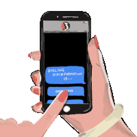

<body>
	 
	

		
	

	

	
	
    

	    <h1><b>Hi, call me ARRA  👋 </b></h2>
    

    

      <li>💬 21, Computer Science Student from the Philippines
      <li>🌱 Currently trying learning everything lol
      <li>⚡ I love movies, series, music, journals, kpop
      <li>👯 I’m looking to collaborate with anyone on any projects
      </li>
    

		<h2> <b> Connect With Me: </b></h2>

	
	 
   
  

  		
 </body> 

<!--
**arraalmira/arraalmira** is a ✨ _special_ ✨ repository because its `README.md` (this file) appears on your GitHub profile.

Here are some ideas to get you started:

- 🔭 I’m currently working on ...
 🌱 I’m currently learning...
- 👯 I’m looking to collaborate on ...
- 🤔 I’m looking for help with ...
- 💬 Ask me about ...
- 📫 How to reach me: ...
- 😄 Pronouns: ...
- ⚡ Fun fact: ...
-->
